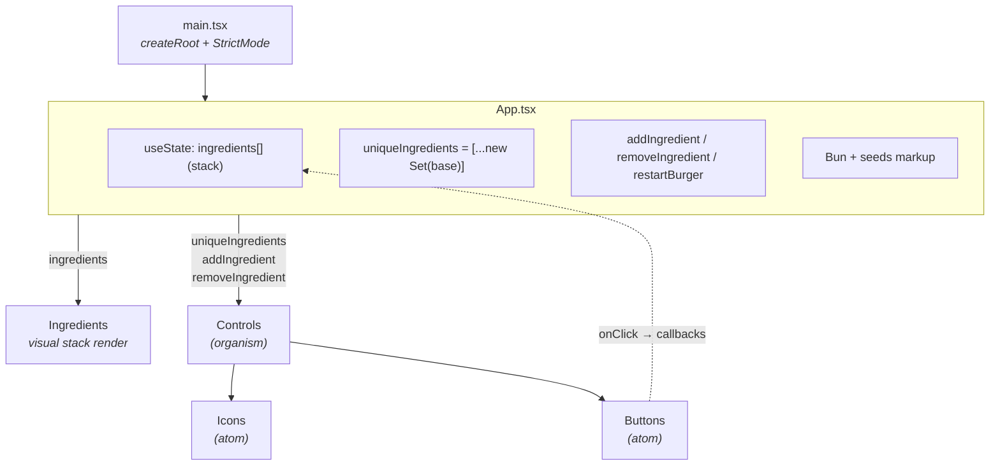
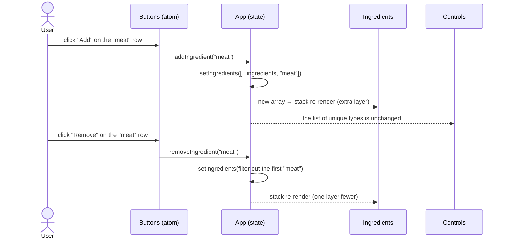

# 🍔 Burger Builder

Single-page app for **building a burger interactively**: add and remove ingredients from a
control panel and the burger redraws in real time. Every ingredient layer is rendered with
**pure CSS** (no images for the stack), so the project is really an exercise in component
composition, React state management and CSS art.

🔗 **Live demo:** <https://burguer-builder-m89t310qu-eduardo-cornejos-projects.vercel.app/>

> **Status:** small, working project with known tech debt. This README documents the
> **current** architecture as a step before refactoring — see
> [Known limitations](#known-limitations) and [Refactor roadmap](#refactor-roadmap).

---

## Table of contents

- [Why this project exists](#why-this-project-exists)
- [Tech stack](#tech-stack)
- [Requirements](#requirements)
- [Getting started](#getting-started)
- [Deployment](#deployment)
- [Available scripts](#available-scripts)
- [Project structure](#project-structure)
- [Architecture](#architecture)
  - [Component view](#component-view)
  - [Data flow](#data-flow)
  - [Styling strategy](#styling-strategy)
  - [Architecture decisions (ADR)](#architecture-decisions-adr)
- [Known limitations](#known-limitations)
- [Refactor roadmap](#refactor-roadmap)

---

## Why this project exists

The goal isn't the product — it's practising frontend fundamentals in a small, controlled
scope:

| Learning goal                  | How the project exercises it                                                                |
| ------------------------------ | ------------------------------------------------------------------------------------------- |
| Component composition in React | Tree `App → Controls → { Icons, Buttons }` plus `App → Ingredients`                         |
| State and derived rendering    | `ingredients` (the stack) is the source of truth; `uniqueIngredients` is derived with `Set` |
| Parent → child communication   | Data props and callbacks (`addIngredient`, `removeIngredient`)                              |
| Folder organization            | Taxonomy inspired by Atomic Design (`atoms/`, `organism/`)                                  |
| Advanced CSS                   | Ingredient shapes with `clip-path`, gradients, `box-shadow`, `@keyframes`                   |
| Modern tooling                 | Vite + strict TypeScript + ESLint                                                           |

It is deliberately **client-only**: no backend, no persistence, no auth. The scaffold was
generated from the official Vite template
(`npm create vite@latest -- --template react-ts`).

---

## Tech stack

| Layer              | Technology                                    | Version        | Why                                                         |
| ------------------ | --------------------------------------------- | -------------- | ----------------------------------------------------------- |
| UI                 | [React](https://react.dev/)                   | 18.2           | Component model + hooks state                               |
| Language           | [TypeScript](https://www.typescriptlang.org/) | 5.2 (`strict`) | Typed props, safer refactors                                |
| Build / dev server | [Vite](https://vitejs.dev/)                   | 5.2            | Near-instant startup and HMR                                |
| Linting            | [ESLint](https://eslint.org/)                 | 8.57           | `eslint:recommended` + `@typescript-eslint` + `react-hooks` |
| Package manager    | [Yarn Classic](https://classic.yarnpkg.com/)  | 1.22           | `yarn.lock` is committed                                    |
| Styling            | Plain co-located CSS                          | —              | One `.css` per component, imported from the `.tsx`          |

**Not used** (by scope choice): router, global state library, component library, test
framework, SSR.

---

## Requirements

- **Node.js** ≥ 20 (LTS 20 or 22 recommended)
- **Yarn Classic** ≥ 1.22 (`npm install --global yarn`)
- Git

---

## Getting started

```bash
# 1. Clone
git clone git@github.com:EdouardoCornejo/Burguer-Builder.git
cd Burguer-Builder

# 2. Install dependencies
yarn

# 3. Start the dev server
yarn dev
```

Vite serves the app at **http://localhost:5173** with hot reload.

### Production build

```bash
yarn build     # type-check (tsc) + bundle into dist/
yarn preview   # serve dist/ locally to verify the build
```

---

## Deployment

Deployed on **Vercel**: <https://burguer-builder-two.vercel.app/>

| Setting          | Value        |
| ---------------- | ------------ |
| Framework preset | Vite         |
| Build command    | `yarn build` |
| Output directory | `dist`       |
| Install command  | `yarn`       |

A push to `main` triggers a production deploy; pull requests get automatic preview
deployments.

---

## Available scripts

| Script         | Command                                  | Description                        |
| -------------- | ---------------------------------------- | ---------------------------------- |
| `yarn dev`     | `vite`                                   | Dev server with HMR                |
| `yarn build`   | `tsc && vite build`                      | Type-check and bundle into `dist/` |
| `yarn preview` | `vite preview`                           | Preview the production bundle      |
| `yarn lint`    | `eslint . --ext ts,tsx --max-warnings 0` | Lint; fails on any warning         |

---

## Project structure

```text
Burguer-Builder/
├── index.html                  # HTML entry point (mounts #root)
├── vite.config.ts              # Vite config (React plugin only)
├── tsconfig.json               # Strict TS for src/
├── tsconfig.node.json          # TS for config files (Vite)
├── .eslintrc.cjs               # ESLint rules
│
├── public/                     # Assets served as-is (favicon)
│
└── src/
    ├── main.tsx                # React bootstrap (createRoot + StrictMode)
    ├── App.tsx                 # State, business logic and burger layout
    ├── App.css                 # Bun, seeds and restart-animation styles
    ├── index.css               # Global styles (typography, color-scheme)
    │
    ├── assets/                 # Control-panel icon PNGs + renew.svg
    │
    └── components/
        ├── index.ts            # Root barrel: re-exports ingredients and controls
        │
        ├── ingredients/
        │   ├── Ingredients.tsx # Renders the stack: one <div> per layer (class = ingredient)
        │   ├── ingredients.css # CSS shapes for salad / beacon / cheese / meat / tomato
        │   └── index.ts
        │
        ├── atoms/
        │   ├── index.ts
        │   ├── ctrlBtn/
        │   │   └── Buttons.tsx # "Add" / "Remove" buttons for one control row
        │   └── Icons/
        │       └── Icons.tsx   #  for an ingredient icon
        │
        └── organism/
            ├── index.ts
            └── controls/
                └── Controls.tsx # Panel: one row (Icons + label + Buttons) per ingredient
```

**Conventions**

- **Barrel files** (`index.ts`) in each folder, so imports come from `./components`
  instead of deep paths.
- **Co-located CSS**: each component imports its own `.css`, but **class names are global**
  (no CSS Modules).
- The folder is `organism` (singular) vs `atoms` (plural); there is no `molecules/`.

---

## Architecture

In one line: **a React SPA with no router, all state in `App.tsx`, and props-based
communication down a 3-level tree.**

### Component view



**Atomic Design layers (partial):**

| Level            | Component     | Responsibility                                                     |
| ---------------- | ------------- | ------------------------------------------------------------------ |
| Atom             | `Buttons`     | Add/Remove pair that calls the parent's callbacks                  |
| Atom             | `Icons`       | Renders the ingredient `` from an image map                   |
| Organism         | `Controls`    | Builds an `Icons + label + Buttons` row per unique ingredient      |
| _(unclassified)_ | `Ingredients` | Turns the state array into visual layers (`<div class="meat">`, …) |
| Container        | `App`         | State, logic, domain data and bun layout                           |

### Data flow

Single source of truth: the `ingredients` array in `App`. The control panel works on
`uniqueIngredients` (fixed list of available types); `Ingredients` works on the full stack
(with repeats and order).



`restartBurger` resets the stack to the base array **and** triggers a spin animation on the
restart icon by touching the DOM directly (`document.querySelector(".restart")` +
`classList`) — see [ADR-005](#adr-005--restart-animation-via-direct-dom-access).

### Styling strategy

- One `.css` file per component, imported from its `.tsx`.
- **The ingredient id is data, image-map key and CSS class name at the same time.**
  `Ingredients` does `<div className={ingredient}></div>` and `ingredients.css` defines
  `.salad`, `.beacon`, `.cheese`, `.meat`, `.tomato` with `clip-path`, gradients and
  `box-shadow`.
- No scoping: classes like `.container`, `.control`, `.box` live in the global scope.
- No design tokens or shared CSS variables (colors are hardcoded).

---

### Architecture decisions (ADR)

Format: **chose X because Y, at the cost of Z.** These describe the _current_ state, not
necessarily the ideal one.

#### ADR-001 · SPA with Vite + React + TS, no meta-framework

- **Chose** a client-only SPA from Vite's `react-ts` template instead of Next.js / Remix.
- **Because** the scope is a single screen with no backend and no SEO need; Vite gives
  near-instant startup and HMR with zero config.
- **At the cost of** no SSR, routing, data fetching or enforced conventions — those must be
  added by hand if the project grows.

#### ADR-002 · All state in `App.tsx` with `useState` + prop drilling

- **Chose** to keep state (`ingredients`) in the root component and pass data and callbacks
  down as props.
- **Because** the tree is 3 levels deep with a single view; Context / Redux / Zustand would
  be over-engineering.
- **At the cost of** `App.tsx` concentrating domain data, state, logic, a DOM side effect
  and layout markup; the add/remove logic isn't testable in isolation, and every new
  feature pushes more props downward.

#### ADR-003 · Folder taxonomy inspired by Atomic Design

- **Chose** to organize `src/components/` into `atoms/` and `organism/`.
- **Because** it gives a shared vocabulary and sets up a larger component catalog.
- **At the cost of** being half-applied today: no `molecules/`, `Ingredients` sits outside
  the taxonomy, `Controls` is labeled an _organism_ while it's closer to a _molecule_, and
  the folder depth (`atoms/ctrlBtn/Buttons.tsx`) isn't paid back in value. For 4
  components, a flat feature-based layout would be simpler.

#### ADR-004 · Plain co-located CSS, ingredient name as class

- **Chose** one `.css` per component and using the ingredient string directly as
  `className` and as the image-map key.
- **Because** it needs no extra build config and couples the visual render to the data with
  zero boilerplate.
- **At the cost of** global classes that can collide (`.container`, `.control`), no
  tokens/theme, and **adding an ingredient means touching 4 places**: the data array, the
  `ingredientsImages` map in `Controls`, the `IngredientImages` interface in `Icons`, and
  the CSS. There is no single `Ingredient` domain model.

#### ADR-005 · Restart animation via direct DOM access

- **Chose** to implement the "restart" animation with `document.querySelector` +
  `classList.add("rotate")` + an `animationend` listener.
- **Because** it's the shortest way to fire a `@keyframes` once.
- **At the cost of** breaking React's declarative model (imperative DOM access inside a
  component), coupling to a global selector and making testing harder. The idiomatic way
  is state / `ref` and re-mounting the animation with a `key` or toggling a class from
  state.

#### ADR-006 · Yarn Classic as package manager

- **Chose** Yarn 1.x (there is a committed `yarn.lock`).
- **Because** it was the environment standard when the project was created.
- **At the cost of** Yarn Classic being in maintenance mode; npm, pnpm or modern Yarn are
  more current. Switching means regenerating the lockfile.

---

## Known limitations

> Honest inventory to guide the refactor. Not blockers — the app works.

**Naming**

- `burger` vs `burguer`: the repo name, some variables (`burguer`) and copy mix both
  spellings.
- `beacon` instead of `bacon`: the typo spreads across the data, the asset name
  (`beacon.png`) and the CSS class (`.beacon`).

**Components**

- `App.tsx` mixes concerns: domain data, state, logic, a DOM side effect and bun markup.
- `Ingredients.tsx` uses `index` as `key` and wraps each item in a pointless `<>…</>`; the
  `key` is on the inner `<div>`, not on the element returned by `map`.
- `Icons.tsx`: the `IngredientImages` interface omits `tomato` and is out of sync with the
  real data; it falls back to a cast `Images[ingredient as keyof typeof Images]`.
- `removeIngredient`: the condition
  `ing !== ingredient || index !== ingredients.indexOf(ingredient)` is hard to read
  (removes the first occurrence). Likely the origin of fix `95634dd`.
- `Controls` is labeled an _organism_ but is functionally a _molecule_.

**Tooling and project**

- No tests (no Vitest / Testing Library) and no CI.
- No Prettier or `.editorconfig`; formatting depends on the editor.
- No `engines` / `.nvmrc`: the Node version isn't pinned.
- `index.html`: the `<title>` is still `Vite + React + TS` and the favicon is `vite.svg`.

---

## Refactor roadmap

Suggested order, lowest to highest risk:

1. **Fix naming** (`bacon`, `burger`) across data, assets and CSS.
2. **`Ingredient` domain model** in one module: `{ id, label, image, order }`. Removes the
   magic strings and the "touch 4 places" problem.
3. **Extract a `useBurger()` hook** (`add`, `remove`, `reset`, `stack`) to lift logic out
   of `App.tsx` and make it testable in isolation.
4. **Replace the DOM access** in `restartBurger` with state + a CSS animation (remount key
   or state-driven class).
5. **Pick a styling strategy**: CSS Modules, Tailwind or vanilla-extract, with a set of
   tokens (colors, spacing).
6. **Revisit the folder taxonomy**: either complete Atomic Design deliberately or move to a
   flat feature-based layout matching the real size.
7. **Add Vitest + Testing Library** and a CI workflow (`lint` + `build` + `test`).
8. **Project hygiene**: real `title`/favicon, `engines`, Prettier.
